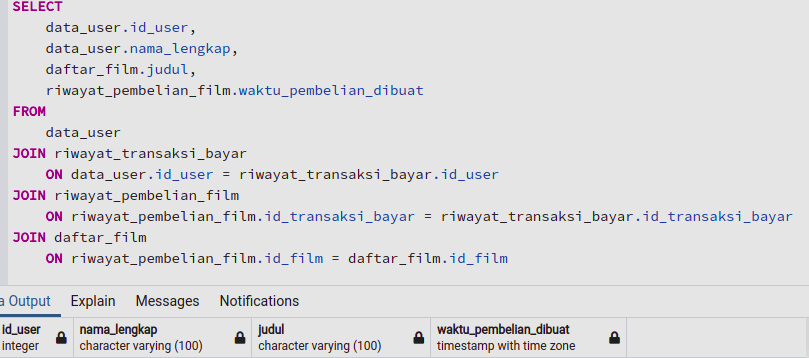
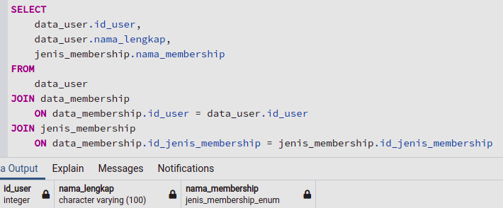

# Stored Procedures Movie Store Database

## Keterangan Direktori

Pada direktori ini, disimpan dua buah query sql yang dapat digunakan untuk memperoleh dua data:

1. riwayat pembelian movie oleh user
2. data membership user.
   Untuk saat ini saya belum terlalu paham cara membuat stored procedure. Oleh karena itu saya simpan terlebih dahulu query sql untuk kedua use case di atas.

## Hasil Query

Berikut adalah gambar hasil tabel yang diperoleh dengan dua query sebelumnya:

 
Riwayat pembelian film / movie oleh user

 
Data membership user
